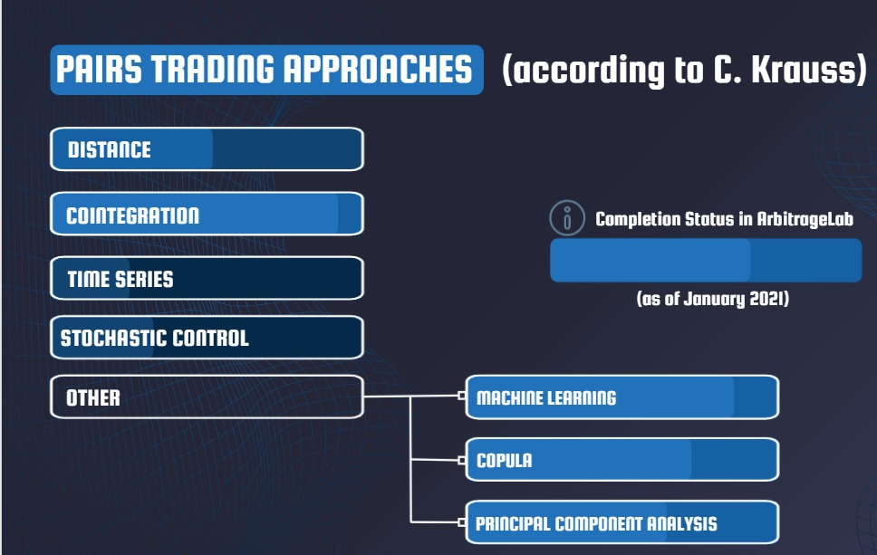

# Pair-Trading-Strategy
Summer 2021 project under Finance &amp; Analytics Club, IIT Kanpur

Pairs trading is a strategy in which we use various statistical methods to  pair-up 2 stocks whose prices have moved together in the past and are potentially market neutral. We monitor the spread between the prices and when these prices diverge, we short the winner and buy the loser. The paper can be read from [here](https://www.researchgate.net/publication/227624374_Pairs_Trading).

 

There are two approaches:
## Distance Approach
The approach was proposed in a research paper  by Gatev et al
In simple words the distance approach is when two stock prices are taken to see if they’re moving together based on a simple metric like a simple Euclidean distance. Then the spread of these two prices is calculated during the trading period and if it diverges greatly we just TRADE!!

